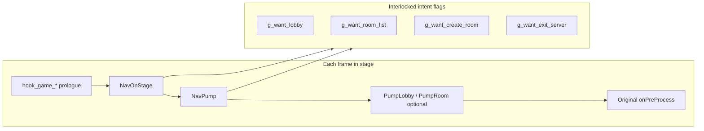
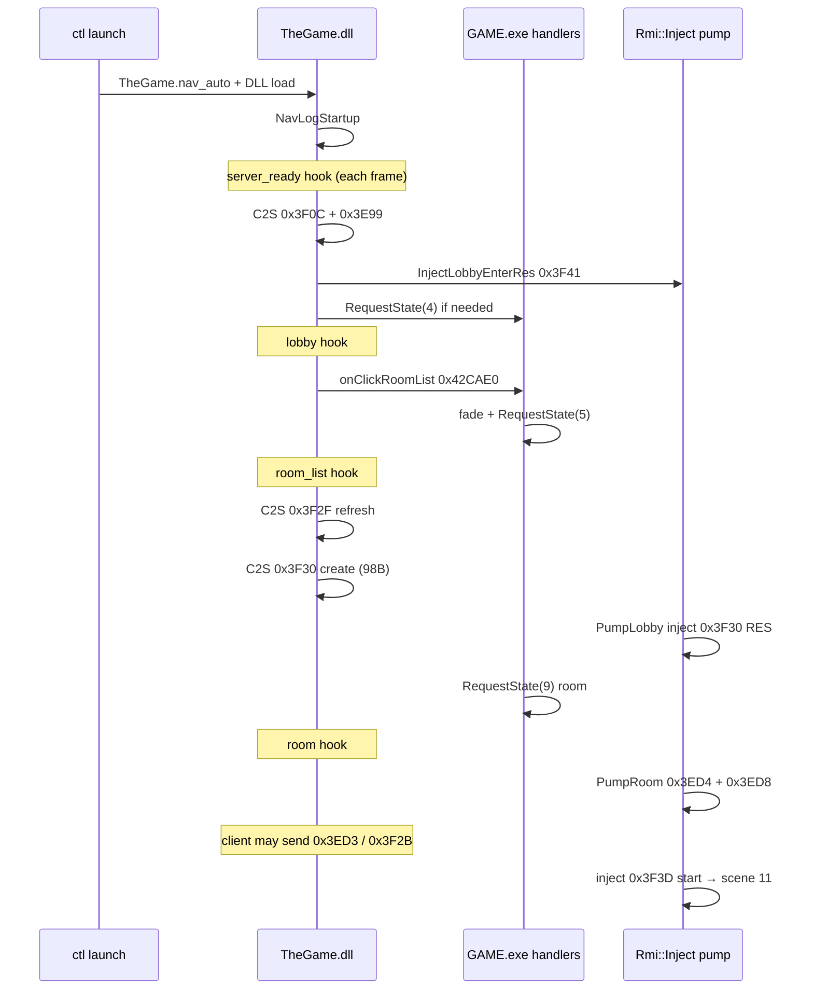

# Lobby navigation (handler pipe)

**TheGame.dll** drives post-shard UI transitions from ctl via the **handler named pipe** (`thegame-handler`, duplex). The elevated daemon accepts the game client; ctl sends line-oriented commands; the DLL replies with one line per request.

**Deprecated:** env/sidecar autonav (`THEGAME_NAV_AUTO`, `THEGAME_NAV_ACTION`, `TheGame.nav_auto`) is a **no-op** — use `ctl send` / `just ctl::send` instead.

**Related:** [ctl/README.md](../../ctl/README.md) (handler protocol), [client.md](client.md), [overview.md](overview.md), [../plans/proudnet-game-rmi.md](../plans/proudnet-game-rmi.md).

---

## Handler pipe (current)

| Direction | Payload |
| --- | --- |
| ctl → game | One UTF-8 line per command, `\n`-terminated |
| game → ctl | One response line |

| Command | Response | Main-thread effect |
| --- | --- | --- |
| `commands` | `nav_goto_lobby` (comma-separated list) | — |
| `nav_goto_lobby` | `ok` | Queue → `NavDrainCommands` arms C2S enter + `g_want_lobby`; `NavPump` runs `try_goto_lobby` |

**Threading:** a **reader thread** ([`handler_pipe.cpp`](../../src/diagnostics/handler_pipe.cpp)) reads the pipe and enqueues work; **never** calls game UI/RMI/inject. **`NavPump`** ([`Nav.cpp`](../../src/RMI/Nav.cpp)) drains the queue on the **main thread** from `game_state` hooks (`server_ready`, `lobby`, …).

**Shard picker:** `shard_choice` is still **manual** on online launch; pipe nav starts after `server_ready`.

### Verification (online)

```powershell
just build-debug
just ctl::copy-dll
just ctl::launch
just ctl::wait-menu                    # server_ready (pick shard first if needed)
just ctl::commands                     # expect nav_goto_lobby in handlers
just ctl::send nav_goto_lobby
just ctl::wait-stage lobby 120
just ctl::copy-logs
just ctl::kill-all
```

Grep `events.jsonl` / `game_logs.txt` for `nav: command nav_goto_lobby`, `nav: c2s 0x3F0C`, `game_state` → `lobby`.

---

## Legacy autonav (`THEGAME_NAV_AUTO`) — removed

The sections below describe the **previous** env-driven state machine (retained for RMI/hook reference). It is **not** active in current builds.

---

## How autonav worked (principles)

Autonav is **not** a GFx click simulator and **not** a hook on Scaleform button widgets. It is a **small state machine in TheGame.dll** that runs when the game’s own **`IState::onPreProcess`** prologues fire (same thread and call stack as normal frame logic).

### What actually gets called

| Kind | What we do | Typical GFx / human equivalent |
| --- | --- | --- |
| **Stage hook** | Detour first 6 bytes of each `CGame*::onPreProcess`; emit ctl `game_state` + call `NavOnStage` / `NavPump` | “We entered this screen this frame” |
| **One real UI handler** | `sub_42CAE0` (`onClickRoomList`) with `MsgDelegateArg* = nullptr` | Custom Match → room list button |
| **State machine API** | `sub_41F0D0` (`RequestState`) on `&dword_1C155C0` | Direct scene change when click/inject is not enough |
| **C2S RMI** | `sub_65AEA0` (proxy, explicit id) or `sub_A0B290` (floor, id in first u16 of buffer) | What the screen’s `onPreProcess` would have sent |
| **S2C inject** | Call RES **leaf** handlers (`sub_4BA740`, `sub_437160`, …) with a synthetic `MsgDelegateArg` body pointer | Offline server answer the client is waiting for |

We **do not** call today: `sub_48A7C0` (create-room dialog / `ClickCreateRoom`), armory, operative, shop, or chat UI handlers — only wire paths or one list button.

### Threading

| Context | Safe for nav/inject? |
| --- | --- |
| **`game_state` hooks** (`hook_game_*` in [`game_state.cpp`](../../src/hooks/game_state.cpp)) | **Yes** — main thread, during `onPreProcess` before original game code resumes |
| **`NavPump` / `try_*` / `invoke_on_click_room_list`** | **Yes** — only reached from those hooks (or `NavOnStage` in the same call) |
| **`PumpLobby` / `PumpRoom`** | **Yes** — called from lobby / room_list / room hooks on main thread |
| **`GameSendHook`** (`hook_pn_game_rmi_send` @ `0x65AEA0`, `hook_pn_game_rmi_floor` @ `0xA0B290`) | **Observe only** — sets inject latches; does **not** call UI or inject |
| **ProudNet worker / `pn_drain_recv`** | **No** — never call UI, `RequestState`, or RES leaves from here |

Logs include `(tid=…)` on `nav:` lines so you can confirm main-thread execution.

### Control model: flags, stages, and chaining

Autonav is driven by **ctl stage names** (strings), not by scene ids directly. Each hooked `onPreProcess` maps to a stage; `NavOnStage(phase)` sets **intent flags**; `NavPump(phase)` performs **retries** until transitions succeed or guards block.



| Function | When | Role |
| --- | --- | --- |
| **`NavOnStage(phase)`** | Once per hooked frame for that phase | Latch work: e.g. `server_ready` → send enter C2S + `g_want_lobby`; `lobby` → `g_want_room_list` or `g_want_exit_server` |
| **`NavPump(phase)`** | Same frame, after `NavOnStage` | Execute flags: `try_goto_lobby`, `try_goto_room_list`, `try_create_room`, `try_exit_to_server`; then **`pump_one_shot_actions()`** |
| **`pump_one_shot_actions()`** | End of every `NavPump` | Run `THEGAME_NAV_ACTION` once when scene matches and **`byte_1C1E409 == 0`** (not mid-fade) |

**Chaining (`create_room`):** `server_ready` arms `g_want_lobby` → pump reaches scene **4** → arms `g_want_room_list` → pump calls **`onClickRoomList`** or `RequestState(5)` → `room_list` arms `g_want_create_room` + sends `0x3F2F`/`0x3F30` → inject or server moves to scene **9** → `PumpRoom` fills maps.

**Guards:** `transition_locked()` reads **`byte_1C1E409`**; while set, `RequestState` and `onClickRoomList` log “blocked” and pump retries next frame. **`g_did_server_ready`** / **`g_did_create_send`** / **`g_action_done`** prevent duplicate one-shots.

**`THEGAME_NAV_ACTION` + `create_room`:** `chat_ping` and `quick_match` set **`action_blocks_create_forward()`** so autonav **stays on lobby** (does not arm `g_want_room_list`). Actions run from **`pump_one_shot_actions`** after transitions settle, not from `nav_on_lobby` in the same frame as inject.

### Enablement recap

Nav runs if **`THEGAME_NAV_AUTO`** is a known mode **or** **`THEGAME_NAV_ACTION`** is set (action alone enables hooks). Values are read **once at DLL init** (env + optional `TheGame.nav_auto` sidecar for auto mode only). ctl **`ctl.env`** is merged into the game process on each **`launch`** ([`fresh_settings()`](../../ctl/controller/config.py) — no daemon restart for nav keys).

---

## Hooks: ctl stages, GAME classes, and TheGame.dll entry points

All gameplay hooks use the same pattern: save registers → call diagnostics C function → restore → execute original 6-byte prologue → jump to `target+6`. Installed from [`game_state.cpp`](../../src/hooks/game_state.cpp) / [`target_hooks.h`](../../include/target_hooks.h).

| ctl `game_state` | Hook symbol | RVA (GAME VA) | Class / notes | Autonav calls |
| --- | --- | --- | --- | --- |
| `intro` | `hook_game_intro` | `0x42A010` | `CGameIntro` | — |
| `login` | `hook_game_login` | `0x42B280` | `CGameLogin` | — |
| `shard_choice` | `hook_game_server_select` | `0x4345B0` | `CGameServer` onPreProcess **begin** | — |
| **`server_ready`** | `hook_game_main_menu` | `0x4347CC` | `CGameServer` onPreProcess **end** (misleading name) | `NavOnStage` + `NavPump` |
| **`lobby`** | `hook_game_lobby` | `0x42BD50` | `CGameLobby` | + `PumpLobby` (0x3F40 → 0x3F41 latch) |
| **`room_list`** | `hook_game_room_list` | `0x4362E0` | `CGameRoomList` | + `PumpLobby` (create RES) |
| `party_room` | `hook_game_party_room` | `0x42F690` | `CGamePartyRoom` | — |
| **`room`** | `hook_game_room` | `0x439B00` | `CGameRoom` | + `PumpRoom` (populate / start / leave) |
| `char_select` | `hook_game_char_select` | `0x4F2DB0` | — | — |
| **`map_loading`** | `hook_game_map_loading` | `0x4806E0` | `CBasePlayLoading` | diagnostics only |
| **`in_game`** | `hook_game_in_game` | `0x47F610` | `CGamePlay` | diagnostics only |

**RMI observe/inject (separate from stage hooks):**

| Hook | RVA | Role |
| --- | --- | --- |
| `hook_pn_game_rmi_send` | `0x65AEA0` | Log proxy C2S; `NoteC2sSend(id)` → inject latches |
| `hook_pn_game_rmi_floor` | `0xA0B290` | Log floor C2S (id from message) |

**DLL API** ([`Nav.hpp`](../../include/RMI/Nav.hpp)): `NavLogStartup()` in [`entrypoint.cpp`](../../src/hooks/entrypoint.cpp); `NavOnStage` / `NavPump` from table above; inject via [`Inject.hpp`](../../include/RMI/Inject.hpp) `PumpLobby`, `PumpRoom`, `InjectLobbyEnterRes`.

---

## UI elements and GAME.exe symbols (concrete map)

Scene ids from **`dword_1C15644`**. State machine ECX = **`&dword_1C155C0`**.

### Transitions we drive

| User-facing control | Mechanism | RVA / RMI | Used by autonav? |
| --- | --- | --- | --- |
| Enter shard / server screen done | Hook only (no click) | `0x4347CC` | Indirectly (`server_ready`) |
| Enter custom-match **lobby** (main menu w/ Quick/Custom) | C2S + inject RES + optional `RequestState(4)` | C2S `0x3F0C`/`0x3E99`; inject `0x3F41` @ `0x4BA740` | **Yes** (`try_goto_lobby`) |
| **Custom Match** → room list | **UI handler** or `RequestState(5)` | **`sub_42CAE0`**, fade `sub_49E530` / `sub_40B340` inside handler | **Yes** (preferred path) |
| Room list refresh | Game `CGameRoomList::onPreProcess` + nav duplicate | C2S `0x3F2F` / floor `0x3A9F` | **Yes** (nav sends once in list stage) |
| **Create room** (dialog OK) | C2S only (no `sub_48A7C0`) | C2S `0x3F30` / floor `0x3AA0`, 98 B; RES `0x437160` | **Yes** (wire + inject) |
| Create room via GFx dialog | `ClickCreateRoom` | **`sub_48A7C0`** | **No** (needs live `MsgDelegateArg` + bound name) |
| Room populate | Inject RES | `0x3ED4` @ `0x4BB560`, `0x3ED8` @ `0x4BB370` | **Yes** (`PumpRoom`) |
| Ready → start match | Client C2S + inject | C2S `0x3F2B`; inject `0x3F3D` @ `0x43D9B0` | **Inject only** (latched on Ready) |
| **Quick Dive** | Proxy C2S | `0x3EE4` / floor `0x3AAF`, 3 B | **Action only** (`quick_match`) |
| **Global chat** | Floor C2S | `0x3AD2`, 36 B | **Action only** (`chat_ping`) — **broken** from DLL |
| Leave room | Proxy C2S + inject RES | `0x3F45` / `0x3AA3`; leaf `0x43D020` | **Action / exit** |
| Exit to shard picker | `RequestState(2)` + C2S leave | `0x3F0C` proxy; floor `0x3ACD` len 6 **not sent** | **Yes** (`exit_lobby`) |

### Globals and send helpers

| RVA | Symbol / role |
| --- | --- |
| `0x41F0D0` | `RequestState(scene)` — `__thiscall` |
| `0x42CAE0` | `onClickRoomList` — `__stdcall(MsgDelegateArg*)`, **null arg OK** |
| `0x48A7C0` | `ClickCreateRoom` — **do not call** without GFx context |
| `0x65AEA0` | Proxy send — `__thiscall`, `ecx = dword_1C1ABA0` |
| `0xA0B290` | Floor send — proxy in **EAX** = `dword_1C1ABB0` |
| `0x1C155C0` | State machine instance |
| `0x1C15644` | Current scene id |
| `0x1C1E409` | Transition lock (nonzero = in fade) |
| `0x1C1A87C` | Leave-room mode dword (`sub_43D020`) |
| `0x1C25E2C` | Play context pointer; start RES needs non-null |

### Lobby-enter notify (not the Custom Match button)

When scene **4** runs, the game sends C2S **`0x3F40`** (floor `0x3ACE`). `NoteC2sSend` sets **`g_pending_lobby_enter`**; **`PumpLobby`** on the same main thread injects **`0x3F41`** so the client does not sit in lobby without RES (offline regression). This is separate from **`onClickRoomList`** (`0x3F2F` is list refresh on scene **5**, not `0x3F40`).

---

## Current coverage (what works, what does not)

Verified offline with ctl matrix **`just ctl::run-nav-matrix`** (runs **228–232**, elevated daemon, inject on) unless noted.

| Mode / action | ctl wait target | Status | Evidence / notes |
| --- | --- | --- | --- |
| **`create_room`** / **`full`** | `lobby` → `room_list` → `room` | **Works** | **206**, **209**, **228**; UI click + inject path |
| **`exit_lobby`** | `server_ready` after `lobby` | **Works** | **213**, **231**; `nav: exit_to_server done` |
| **`THEGAME_NAV_ACTION=quick_match`** | `lobby` | **Works** | **230**; `0x3EE4` + floor `0x3AAF`; does not advance to room list |
| **`THEGAME_NAV_ACTION=leave_room`** | `room` | **Works** | **232**; `0x3F45` sent; inject leave RES on pump |
| **`THEGAME_NAV_ACTION=chat_ping`** | `lobby` | **Fails** | **229**; `0x3AD2` sent then **AV `0xC0000005`** — `send_floor_rmi` / `sub_A0B290` from DLL unsafe |
| **`THEGAME_NAV_ACTION=exit_lobby`** (with `create_room`) | `server_ready` | **Works** | Combines enter + back-out |
| **Forward to `map_loading` / stable match** | `map_loading` | **Partial / flaky** | **206**, **209**: `room` → `in_game` → `map_loading` → **`room`** ~0.5s; no reliable Ready/start without server session |
| **Wire-only** (default **debug** DLL, inject compiled out) | varies | **Fragile** | **207**: reached `lobby` then **`lobby` → `shard_choice`** after `0x000006BA` without `0x3F41` inject |
| **Armory / operative / shop / GFx chat button** | — | **Not mapped** | No handler RVAs in autonav; see UI journal Tier B/C |

**Not hooked for autonav:** `intro`, `login`, `shard_choice` (human/ctl still need shard pick), `party_room`, `char_select`, `map_loading`, `in_game`.

---

## Ordering, conflicts, and wrong-order failures

| Situation | What goes wrong | Mitigation in code |
| --- | --- | --- |
| **C2S / inject without `RequestState`** | Stuck on `server_ready` or empty VM | `try_goto_lobby` + `0x3F41`; list click or `RequestState(5)` |
| **`0x3F40` without `0x3F41` RES** | Lobby unstable; bounce to **`shard_choice`** (run **207**) | `PumpLobby` on lobby hook; keep inject enabled offline |
| **Create RES on worker thread** | Room UI empty → crash in VM | `NoteC2sSend` → `g_pending_populate`; **`PumpRoom`** on main thread before original `CGameRoom::onPreProcess` |
| **`chat_ping` same frame as lobby inject** | AV in floor sender | Defer to **`pump_one_shot_actions`**; still AV — floor path needs RE’d wrapper |
| **`chat_ping` / `quick_match` + `create_room` without block** | Skips lobby action; races to room list | **`action_blocks_create_forward()`** |
| **`exit_lobby` + `chat_ping` in ctl.env** (stale daemon env) | Chat fires during exit; crash | Clear `thegame_nav_action` for exit tests; ctl reloads env each launch |
| **Autonav “rewind” from `map_loading` to `room`** | Looks like nav broke backward | Usually **start/load failure** or leave RES — not `g_want_*` stepping back; check `0x3F3D`, `0x3F45`, `flt_1C25E2C` |
| **Calling `sub_48A7C0` with null name** | No-op; no room | Nav sends **`0x3F30`** directly instead |
| **Pump / UI while `byte_1C1E409` set** | Ignored or partial fade | `NavPump` retries every frame in `server_ready` / `lobby` / `room_list` |

---

## Why not “just send C2S”?

GFx buttons call C++ handlers that:

1. Run **UI fades / transitions** (`sub_49E530`, `sub_40B340`, …).
2. Call **`CStateMachine::RequestState(scene)`** (`sub_41F0D0`).
3. Let the new scene’s **`IState::onPreProcess`** send RMIs and bind VM fields.

Sending `sub_65AEA0` alone often leaves the state machine and UI VM out of sync (stuck on `server_ready`, empty room maps, crashes). Autonav therefore mixes:

| Mechanism | When |
| --- | --- |
| **Real UI handler RVAs** | Lobby → room list (`sub_42CAE0`) |
| **`RequestState(scene)`** | Fallback transitions |
| **In-process S2C inject** | Offline lobby enter (`0x3F41`), create-room populate (`Inject.cpp`) |
| **C2S via send proxy** | Server pings, list refresh, 98 B create-room body |

All of this runs on the **main thread** (same as `IState::onPreProcess` hooks).

---

## Enablement

| Source | Precedence |
| --- | --- |
| Env `THEGAME_NAV_AUTO` on **GAME.exe** | First (if GameLauncher forwards env) |
| Sidecar **`<GAME.exe dir>/TheGame.nav_auto`** | Second (one line, e.g. `create_room`) |
| ctl `thegame_nav_auto=` in `ctl/ctl.env` | Used when daemon builds launch env |

**Modes today:** `create_room`, `full` (same pipeline), `exit_lobby` (lobby/main menu back to shard picker).

**Launch recipes:**

```powershell
just ctl::launch-offline-nav          # ctl launch --offline --nav-auto create_room
just launch-offline-nav               # alias at repo root
just ctl::launch-offline-exit-nav     # --nav-auto exit_lobby; wait server_ready (see below)
just launch-offline-exit-nav          # alias at repo root
just ctl::run-exit-lobby-test         # copy-dll → launch → wait server_ready → kill → copy-logs
```

ctl also writes `TheGame.nav_auto` from the **client** before RPC (so a stale elevated daemon still gets the sidecar). **`ctl/ctl.env` is re-read on every `launch`** (no daemon restart for `thegame_nav_auto` / `thegame_nav_action` changes). Restart the daemon only after **ctl Python** changes.

**Startup log** (diagnostics pipe → `events.jsonl` / `game_logs.txt`):

- `nav: startup enabled mode=create_room`
- `nav: startup disabled (no env/sidecar)` — autonav off

**Inject off:** default **debug** build (compiled out). Nav C2S/UI still run; S2C answers need server wire until autonav/inject is reworked.

---

## Architecture



### Source files

| File | Role |
| --- | --- |
| [`src/RMI/Nav.cpp`](../../src/RMI/Nav.cpp) | Autonav state machine, UI/C2S calls |
| [`include/RMI/Nav.hpp`](../../include/RMI/Nav.hpp) | `NavOnStage`, `NavPump`, `NavLogStartup` |
| [`src/RMI/Inject.cpp`](../../src/RMI/Inject.cpp) | S2C RES leaves, `PumpLobby` / `PumpRoom` |
| [`src/hooks/game_state.cpp`](../../src/hooks/game_state.cpp) | Stage hooks → `NavOnStage` + `NavPump` + inject pumps |
| [`src/hooks/entrypoint.cpp`](../../src/hooks/entrypoint.cpp) | `NavLogStartup` at DLL init |
| [`ctl/controller/commands/launch.py`](../../ctl/controller/commands/launch.py) | `--nav-auto`, `write_nav_auto` |
| [`ctl/controller/cli.py`](../../ctl/controller/cli.py) | Client-side sidecar write before RPC |

---

## ctl stages vs scenes (summary)

Full hook table: [Hooks](#hooks-ctl-stages-game-classes-and-thegamedll-entry-points) above. Stages are **not** 1:1 with `dword_1C15644` (e.g. `server_ready` fires while shard UI may still be visible).

| Scene id | ctl stage | Autonav-driven? |
| --- | --- | --- |
| **2** | `shard_choice` / `server_ready` | Enter/exit only (`RequestState(2)`, `0x3F0C`) |
| **4** | `lobby` | Yes — hub for forward/back and one-shot actions |
| **5** | `room_list` | Yes — list refresh + create |
| **9** | `room` | Yes — populate; optional start via Ready |
| **11** | `map_loading` | No nav code — inject/client only |

**`create_room`:** `server_ready` → `lobby` → `room_list` → `room`. **`exit_lobby`:** `server_ready` → `lobby` → `server_ready` (shard picker). See [ordering](#ordering-conflicts-and-wrong-order-failures) for `map_loading` → `room` blink (run **206**).

---

## Pipeline step-by-step (`create_room`)

### 1. `server_ready` (once + pump every frame)

**Trigger:** `diagnostics_game_state_main_menu` → `NavOnStage("server_ready")` + `NavPump`.

| Action | Implementation |
| --- | --- |
| C2S server enter | `0x3F0C` / floor `0x3AD1`, len 2 |
| C2S notify | `0x3E99` / floor `0x3AD4`, len 2 |
| Lobby transition | `InjectLobbyEnterRes()` → leaf `0x4BA740` (`0x3F41`) |
| Fallback | `RequestState(4)` on `&dword_1C155C0` |

Sets `g_want_lobby`; pump retries while `byte_1C1E409` (transition lock) is set.

### 2. `lobby` → `room_list`

**Trigger:** `lobby` hook each frame.

| Action | Implementation |
| --- | --- |
| Preferred | **`sub_42CAE0`** (`onClickRoomList`) — `__stdcall`, `MsgDelegateArg*` may be **nullptr**; runs fade + **`RequestState(5)`** |
| Fallback | `RequestState(5)` if click path does not stick |
| Guards | `!byte_1C1E409`, scene ≠ 5; click also requires scene **4** |

Does **not** send `0x3F2F` here; list REQ is sent from **`CGameRoomList::onPreProcess`** (`sub_4362E0`) when scene 5 enters.

**Do not** use C2S `0x3F40`/`0x3ACE` for this step — that is the **lobby-enter notify** path (`sub_42BD50`), not the custom-match list button.

### 3. `room_list` → `room`

| Action | Implementation |
| --- | --- |
| List refresh | `0x3F2F` / floor `0x3A9F`, len 2 (mirrors scene enter) |
| Create room | `0x3F30` / floor `0x3AA0`, len **98** — floor id + UTF-16 name `re_room` at +2 ([§9a](../plans/proudnet-game-rmi.md)) |

**Not used:** `sub_48A7C0` (ClickCreateRoom) — needs live GFx `MsgDelegateArg` and bound name; null name → no-op.

**Inject cooperation** (`GameSendHook` → `NoteC2sSend`):

- Latch `g_pending_create_room` + `g_pending_populate` on `0x3F30` C2S.
- `PumpLobby()` (from `room_list` hook) may call `inject_create_room_res()` → `sub_437160` → **`RequestState(9)`** if server did not answer.

### 4. `room` — populate + optional fast path to load

**`PumpRoom()`** (before original `CGameRoom::onPreProcess`):

| Order | Inject | Purpose |
| --- | --- | --- |
| 1 | `0x3ED4` | Compact member map (`sub_4BB560` / `sub_962020`) |
| 2 | `0x3ED8` | UI member map slot 0 (168 B) — avoids empty VM bind crash |
| 3 | `0x3F3D` | Start-match RES if `g_pending_start` (Ready latch) |

Client often auto-sends **`0x3ED3`** (room enter) on scene 9; `NoteC2sSend` re-arms populate so main-thread inject wins over empty server wire.

If **`0x3F2B`** (Ready) is seen once, inject fires **`0x3F3D`** → **`RequestState(11)`** → **`map_loading`** / **`in_game`** in logs. That is why a full autonav session can “blink” past the room UI without a separate nav mode for start.

---

## Mode `exit_lobby` (`THEGAME_NAV_AUTO`)

Reverse path from custom-match UI back to the shard picker (`ctl` stage **`server_ready`** / engine scene **2**).

| Step | Action |
| --- | --- |
| `server_ready` | Same enter pair as `create_room`: C2S **`0x3F0C`** (floor `0x3AD1`) + **`0x3E99`** (`0x3AD4`), then **`InjectLobbyEnterRes`** / `RequestState(4)` so the client reaches **lobby** |
| `lobby` / `room_list` / `room` | Sets `g_want_exit_server` |
| `NavPump` | **`RequestState(2)`** on `&dword_1C155C0`, then C2S **`0x3F0C`** leave (`send_server_leave` — same 2 B floor `0x3AD1` as enter; full human exit also uses floor **`0x3ACD`** len 6, not sent from the DLL yet) |
| From **room** | **`0x3F45`** leave (floor `0x3AA3`, 6 B) first, then scene change + server leave |

Does **not** depend on create-room inject (`0x3F30` RES). Lobby-enter **`0x3F41`** inject is still used on the initial `server_ready` → lobby hop (same as `create_room`).

**Verify:**

```powershell
just ctl::launch-offline-exit-nav
just ctl::wait-stage server_ready 120
```

Expect `nav: exit_to_server done` in `game_logs.txt` / diagnostics after a prior `lobby` stage in the same session.

---

## One-shot actions (`THEGAME_NAV_ACTION`)

Read once at **DLL init** (no sidecar). Setting **`THEGAME_NAV_ACTION` alone enables** nav hooks. Combinable with `create_room` / `full`; see [coverage](#current-coverage-what-works-what-does-not).

| Action | When it runs | Wire |
| --- | --- | --- |
| **`exit_lobby`** | `g_want_exit_server` chain (same as `exit_lobby` mode) | `RequestState(2)` + **`0x3F0C`** leave |
| **`chat_ping`** | **`pump_one_shot_actions`**, scene **4**, `!byte_1C1E409` | Floor **`0x3AD2`**, 36 B, text `nav_ping` — **AV from DLL** |
| **`quick_match`** | Same pump, scene **4** | Proxy **`0x3EE4`**, floor **`0x3AAF`**, 3 B |
| **`leave_room`** | Same pump, scene **9** | Proxy **`0x3F45`**, floor **`0x3AA3`**, 6 B; inject leave on `PumpRoom` |

Set via **`thegame_nav_action=`** in `ctl/ctl.env` (re-read each **`launch`**) or `THEGAME_NAV_ACTION` on GAME.exe. `chat_ping` / `quick_match` block **`g_want_room_list`** so create_room does not skip the lobby step.

---

## `ctl.env` forwarding (`ctl/controller/config.py`)

The elevated daemon does **not** inherit the shell’s env. `Settings.game_child_env()` merges into **GameLauncher → GAME.exe**:

| `ctl.env` key | Process env | Notes |
| --- | --- | --- |
| `thegame_nav_auto` | `THEGAME_NAV_AUTO` | Overridden by `ctl launch --nav-auto MODE` and client-written `TheGame.nav_auto` |
| `thegame_nav_action` | `THEGAME_NAV_ACTION` | No CLI flag yet; set in `ctl.env` or shell before `ctl launch` on the **client** (value is sent in RPC `child_env`) |

CLI `--nav-auto` still wins for auto mode; sidecar is written client-side before RPC so a stale daemon picks up the mode file.

---

## Threading and `NavPump` (quick reference)

See [How autonav works](#how-autonav-works-principles). **`NavPump`** runs every hooked frame in `server_ready`, `lobby`, and `room_list` (and `room` for exit/leave only). Retries while **`byte_1C1E409`** is set. Intent flags: `g_want_lobby`, `g_want_room_list`, `g_want_create_room`, `g_want_exit_server`.

---

## Verification

```powershell
just ctl::ping                    # elevated: true
just build-debug
just ctl::copy-dll
just ctl::launch-offline-nav
just ctl::wait-stage room_list 120
just ctl::wait-stage room 120
just ctl::copy-logs
# All five nav cases (baseline, chat, quick, exit, leave):
just ctl::run-nav-matrix
```

**Grep** `ctl/logs/runs/<run_id>/events.jsonl`:

| Pattern | Meaning |
| --- | --- |
| `nav: startup enabled` | Sidecar/env OK |
| `nav: onClickRoomList` | UI path used |
| `nav: RequestState(` | Direct scene change |
| `nav: c2s 0x3F30` | Create REQ sent |
| `inject: create-room RES` | PumpLobby transition |
| `inject: room-enter RES` / `room-members` | PumpRoom populate |
| `inject: start RES` | Ready → map load path |
| `game_state` phases | ctl progression |

---

## Extending autonav

### New mode (e.g. `room_list_only`)

1. Add mode string in `nav_enabled()` (`Nav.cpp`).
2. Branch in `NavOnStage` / `NavPump` for fewer `g_want_*` flags.
3. Pass mode via `--nav-auto` or `ctl.env`.

### Deeper UI fidelity

| Goal | Approach |
| --- | --- |
| Real create-dialog fields | Build full 98 B from RE ([§9a](../plans/proudnet-game-rmi.md)) or locate `CRoomSetting*` for `sub_48A7C0` |
| Shard picker / exit | `exit_lobby` mode or action — `RequestState(2)` + `0x3F0C` leave |
| Ready / start without accidental double-fire | Gate `g_start_fired`; optional nav step `ready` only |
| Wire-only (no inject) | default **debug** DLL + server burst ([server.md](server.md)) |

### Diagnostics RPC (future)

Bidirectional ctl pipe (`nav create-room`, …) as in [UI automation journal](../../journals/long/2026-05-29-04-ui-automation-investigation.md) Tier C — today file/env + stage hooks suffice.

---

## Known issues

| Symptom | Likely area |
| --- | --- |
| **Floor send from DLL faults** | `send_floor_rmi` (`sub_A0B290` @ `0xA0B290`, proxy `dword_1C1ABB0`) — used for **`chat_ping`** (`0x3AD2`). Prefer **C2S proxy** (`send_proxy_rmi` / `0x65AEA0`) for new actions; `send_server_leave` intentionally skips floor **`0x3ACD`** until the wrapper is RE'd |
| **`map_loading` → `room` after ~0.5s** | Start/load failure, leave-room RES, or missing dedicated game-server session — investigate `0x3F3D` RES body, `flt_1C25E2C+0x210`, leave `0x3F45`, not nav stages |
| Crash at `0x00962051` / UI VM | Empty `0x3ED8` on worker thread — `PumpRoom` populate + `g_pending_populate` on `0x3F30`/`0x3ED3` |
| Stuck `server_ready` | Nav off (no sidecar), or daemon not writing `TheGame.nav_auto` |
| **Regression run 207** | Nav **disabled** and no **`0x3F41`** lobby-enter inject on offline path → after benign **`0x000006BA`** (`RPC_S_SERVER_UNAVAILABLE`, see [run 179 journal](../../journals/long/2026-05-29-02-c2s-rmi-per-action-ids-run179.md)) client spurious **`lobby` → `shard_choice`** without a deliberate exit. Keep autonav or inject enabled when testing lobby/back-out |

---

## History

- **2026-05-29:** First working autonav — UI `onClickRoomList` + `RequestState` + inject; ctl `--nav-auto` + sidecar; documented after run **206** full lobby→load path.
- **2026-05-29:** `exit_lobby` mode, `THEGAME_NAV_ACTION` one-shots, `ctl.env` nav forwarding; run **207** documents lobby→shard_choice without nav/inject.
- **2026-05-29:** Principles/coverage/hooks sections; `fresh_settings()` per launch; matrix runs **228–232**; `pump_one_shot_actions` + `action_blocks_create_forward`.
