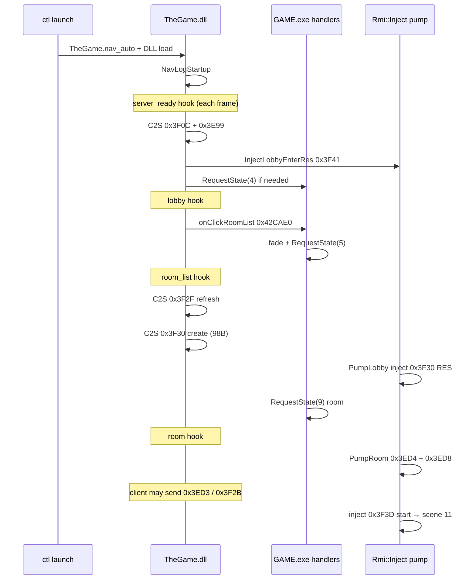

# Autonomous lobby navigation (`THEGAME_NAV_AUTO`)

How **TheGame.dll** drives the offline client from shard picker through custom-match **create room** without GFx clicks. Intended for ctl verification, RMI inject tests, and fast iteration on S2C handlers.

**Related:** [client.md](client.md) (C2S/S2C paths), [overview.md](overview.md) (scene ids), [../plans/proudnet-game-rmi.md](../plans/proudnet-game-rmi.md) (REQ bodies), [../../journals/long/2026-05-29-04-ui-automation-investigation.md](../../journals/long/2026-05-29-04-ui-automation-investigation.md) (original UI-RE notes).

---

## Why not “just send C2S”?

GFx buttons call C++ handlers that:

1. Run **UI fades / transitions** (`sub_49E530`, `sub_40B340`, …).
2. Call **`CStateMachine::RequestState(scene)`** (`sub_41F0D0`).
3. Let the new scene’s **`IState::onPreProcess`** send RMIs and bind VM fields.

Sending `sub_65AEA0` alone often leaves the state machine and UI VM out of sync (stuck on `server_ready`, empty room maps, crashes). Autonav therefore mixes:

| Mechanism | When |
| --- | --- |
| **Real UI handler RVAs** | Lobby → room list (`sub_42CAE0`) |
| **`RequestState(scene)`** | Fallback transitions |
| **In-process S2C inject** | Offline lobby enter (`0x3F41`), create-room populate (`Inject.cpp`) |
| **C2S via send proxy** | Server pings, list refresh, 98 B create-room body |

All of this runs on the **main thread** (same as `IState::onPreProcess` hooks).

---

## Enablement

| Source | Precedence |
| --- | --- |
| Env `THEGAME_NAV_AUTO` on **GAME.exe** | First (if GameLauncher forwards env) |
| Sidecar **`<GAME.exe dir>/TheGame.nav_auto`** | Second (one line, e.g. `create_room`) |
| ctl `thegame_nav_auto=` in `ctl/ctl.env` | Used when daemon builds launch env |

**Modes today:** `create_room`, `full` (same pipeline).

**Launch recipes:**

```powershell
just ctl::launch-offline-nav          # ctl launch --offline --nav-auto create_room
just launch-offline-nav               # alias at repo root
```

ctl also writes `TheGame.nav_auto` from the **client** before RPC (so a stale elevated daemon still gets the sidecar). Prefer restarting the daemon after ctl Python changes.

**Startup log** (diagnostics pipe → `events.jsonl` / `game_logs.txt`):

- `nav: startup enabled mode=create_room`
- `nav: startup disabled (no env/sidecar)` — autonav off

**Disable:** omit env/sidecar, or set `THEGAME_DISABLE_RMI_INJECT=1` only affects inject (nav C2S/UI calls still run; create-room transition may need server wire).

---

## Architecture



### Source files

| File | Role |
| --- | --- |
| [`src/RMI/Nav.cpp`](../../src/RMI/Nav.cpp) | Autonav state machine, UI/C2S calls |
| [`include/RMI/Nav.hpp`](../../include/RMI/Nav.hpp) | `NavOnStage`, `NavPump`, `NavLogStartup` |
| [`src/RMI/Inject.cpp`](../../src/RMI/Inject.cpp) | S2C RES leaves, `PumpLobby` / `PumpRoom` |
| [`src/hooks/game_state.cpp`](../../src/hooks/game_state.cpp) | Stage hooks → `NavOnStage` + `NavPump` + inject pumps |
| [`src/hooks/entrypoint.cpp`](../../src/hooks/entrypoint.cpp) | `NavLogStartup` at DLL init |
| [`ctl/controller/commands/launch.py`](../../ctl/controller/commands/launch.py) | `--nav-auto`, `write_nav_auto` |
| [`ctl/controller/cli.py`](../../ctl/controller/cli.py) | Client-side sidecar write before RPC |

---

## ctl `game_state` stages vs engine scenes

Diagnostics stages come from **onPreProcess prologues** (not 1:1 with `RequestState` ids):

| ctl stage | Hook RVA | Class | Scene id (`dword_1C15644`) |
| --- | --- | --- | --- |
| `server_ready` | `0x4347CC` | CGameServer (end of onEnter) | varies (often still shard UI) |
| `lobby` | `0x42BD50` | CGameLobby | **4** |
| `room_list` | `0x4362E0` | CGameRoomList | **5** |
| `room` | `0x439B00` | CGameRoom | **9** |
| `map_loading` | `0x47F610` | CBasePlayLoading | **11** (via start RES) |
| `in_game` | (play hook) | CGamePlay | after load |

Autonav **`create_room` mode** explicitly drives through **`server_ready` → `lobby` → `room_list` → `room`**. Further stages (`in_game`, `map_loading`) come from **game + inject**, not from `Nav.cpp` today.

Example fast run (**206**): `server_ready` → `lobby` → `room_list` → `room` → `in_game` → `map_loading` → `room` (~1 min session). The brief **`map_loading` then back to `room`** is a **separate** loading/leave-room issue (failed start, leave RES, or missing game-server connection), not autonav rewinding the nav chain.

---

## Pipeline step-by-step (`create_room`)

### 1. `server_ready` (once + pump every frame)

**Trigger:** `diagnostics_game_state_main_menu` → `NavOnStage("server_ready")` + `NavPump`.

| Action | Implementation |
| --- | --- |
| C2S server enter | `0x3F0C` / floor `0x3AD1`, len 2 |
| C2S notify | `0x3E99` / floor `0x3AD4`, len 2 |
| Lobby transition | `InjectLobbyEnterRes()` → leaf `0x4BA740` (`0x3F41`) |
| Fallback | `RequestState(4)` on `&dword_1C155C0` |

Sets `g_want_lobby`; pump retries while `byte_1C1E409` (transition lock) is set.

### 2. `lobby` → `room_list`

**Trigger:** `lobby` hook each frame.

| Action | Implementation |
| --- | --- |
| Preferred | **`sub_42CAE0`** (`onClickRoomList`) — `__stdcall`, `MsgDelegateArg*` may be **nullptr**; runs fade + **`RequestState(5)`** |
| Fallback | `RequestState(5)` if click path does not stick |
| Guards | `!byte_1C1E409`, scene ≠ 5; click also requires scene **4** |

Does **not** send `0x3F2F` here; list REQ is sent from **`CGameRoomList::onPreProcess`** (`sub_4362E0`) when scene 5 enters.

**Do not** use C2S `0x3F40`/`0x3ACE` for this step — that is the **lobby-enter notify** path (`sub_42BD50`), not the custom-match list button.

### 3. `room_list` → `room`

| Action | Implementation |
| --- | --- |
| List refresh | `0x3F2F` / floor `0x3A9F`, len 2 (mirrors scene enter) |
| Create room | `0x3F30` / floor `0x3AA0`, len **98** — floor id + UTF-16 name `re_room` at +2 ([§9a](../plans/proudnet-game-rmi.md)) |

**Not used:** `sub_48A7C0` (ClickCreateRoom) — needs live GFx `MsgDelegateArg` and bound name; null name → no-op.

**Inject cooperation** (`GameSendHook` → `NoteC2sSend`):

- Latch `g_pending_create_room` + `g_pending_populate` on `0x3F30` C2S.
- `PumpLobby()` (from `room_list` hook) may call `inject_create_room_res()` → `sub_437160` → **`RequestState(9)`** if server did not answer.

### 4. `room` — populate + optional fast path to load

**`PumpRoom()`** (before original `CGameRoom::onPreProcess`):

| Order | Inject | Purpose |
| --- | --- | --- |
| 1 | `0x3ED4` | Compact member map (`sub_4BB560` / `sub_962020`) |
| 2 | `0x3ED8` | UI member map slot 0 (168 B) — avoids empty VM bind crash |
| 3 | `0x3F3D` | Start-match RES if `g_pending_start` (Ready latch) |

Client often auto-sends **`0x3ED3`** (room enter) on scene 9; `NoteC2sSend` re-arms populate so main-thread inject wins over empty server wire.

If **`0x3F2B`** (Ready) is seen once, inject fires **`0x3F3D`** → **`RequestState(11)`** → **`map_loading`** / **`in_game`** in logs. That is why a full autonav session can “blink” past the room UI without a separate nav mode for start.

---

## Threading and `NavPump`

| Rule | Reason |
| --- | --- |
| Only call from **game_state** / **entrypoint** hooks | Those run on the main thread during `onPreProcess` |
| Never call UI/`RequestState` from `pn_drain_recv` / inject worker | UI VM races (see crash journals) |
| `NavPump` runs **every frame** while in `server_ready` / `lobby` / `room_list` | Retries when `byte_1C1E409` blocks transitions |

Pending flags: `g_want_lobby`, `g_want_room_list`, `g_want_create_room` (interlocked).

---

## GAME.exe symbols (IDA RVAs = VA)

| RVA | Symbol / role |
| --- | --- |
| `0x41F0D0` | `RequestState(scene)` — `ECX = &dword_1C155C0` |
| `0x42CAE0` | `onClickRoomList` — `__stdcall`, optional `MsgDelegateArg*` |
| `0x48A7C0` | `ClickCreateRoom` — avoid without GFx context |
| `0x65AEA0` | `sub_65AEA0` — C2S proxy (`&dword_1C1ABA0`) |
| `0x1C155C0` | State machine instance |
| `0x1C15644` | Current scene id |
| `0x1C1E409` | Transition lock byte |
| `0x4BA740` | Lobby-enter RES leaf (`0x3F41`) |
| `0x437160` | Create-room RES leaf (`0x3F30`) |
| `0x43D9B0` | Start-match RES leaf (`0x3F3D`) |

---

## Verification

```powershell
just ctl::ping
just build-debug
just ctl::copy-dll debug
just ctl::launch-offline-nav
just ctl::wait-stage room_list 120
just ctl::wait-stage room 120
just ctl::copy-logs
```

**Grep** `ctl/logs/runs/<run_id>/events.jsonl`:

| Pattern | Meaning |
| --- | --- |
| `nav: startup enabled` | Sidecar/env OK |
| `nav: onClickRoomList` | UI path used |
| `nav: RequestState(` | Direct scene change |
| `nav: c2s 0x3F30` | Create REQ sent |
| `inject: create-room RES` | PumpLobby transition |
| `inject: room-enter RES` / `room-members` | PumpRoom populate |
| `inject: start RES` | Ready → map load path |
| `game_state` phases | ctl progression |

---

## Extending autonav

### New mode (e.g. `room_list_only`)

1. Add mode string in `nav_enabled()` (`Nav.cpp`).
2. Branch in `NavOnStage` / `NavPump` for fewer `g_want_*` flags.
3. Pass mode via `--nav-auto` or `ctl.env`.

### Deeper UI fidelity

| Goal | Approach |
| --- | --- |
| Real create-dialog fields | Build full 98 B from RE ([§9a](../plans/proudnet-game-rmi.md)) or locate `CRoomSetting*` for `sub_48A7C0` |
| Shard picker | `RequestState(2)` / connect RES inject — not in nav yet |
| Ready / start without accidental double-fire | Gate `g_start_fired`; optional nav step `ready` only |
| Wire-only (no inject) | `THEGAME_DISABLE_RMI_INJECT=1` + server burst ([server.md](server.md)) |

### Diagnostics RPC (future)

Bidirectional ctl pipe (`nav create-room`, …) as in [UI automation journal](../../journals/long/2026-05-29-04-ui-automation-investigation.md) Tier C — today file/env + stage hooks suffice.

---

## Known issues (outside autonav)

| Symptom | Likely area |
| --- | --- |
| **`map_loading` → `room` after ~0.5s** | Start/load failure, leave-room RES, or missing dedicated game-server session — investigate `0x3F3D` RES body, `flt_1C25E2C+0x210`, leave `0x3F45`, not nav stages |
| Crash at `0x00962051` / UI VM | Empty `0x3ED8` on worker thread — `PumpRoom` populate + `g_pending_populate` on `0x3F30`/`0x3ED3` |
| Stuck `server_ready` | Nav off (no sidecar), or daemon not writing `TheGame.nav_auto` |

---

## History

- **2026-05-29:** First working autonav — UI `onClickRoomList` + `RequestState` + inject; ctl `--nav-auto` + sidecar; documented after run **206** full lobby→load path.
