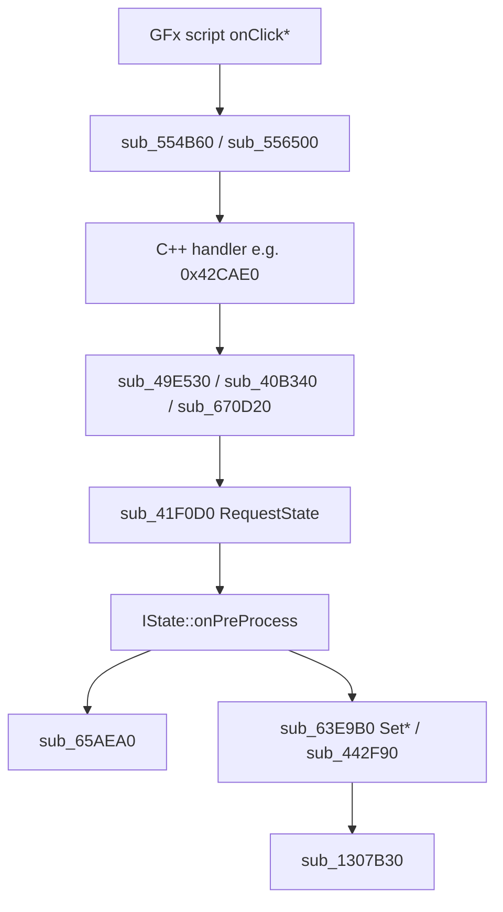

# UI automation - long investigation

## 1. What ctl does today

- **Passive:** `game_stage` phases on `\\.\pipe\thegame-diagnostics` → `events.jsonl`.
- **Active:** launch/kill/copy-dll/logs; `wait-for-stage <phase>`.
- **No** SendInput, PostMessage, UIAutomation, or diagnostics commands to the game.

**Gap:** `ctl/controller/gamestate/stages.py` `KNOWN_STAGES` stops at `main_menu`; DLL emits `server_ready`, `lobby`, `room_list`, `room`, ...

**Stale recipe:** `just ctl::wait-menu` waits for `main_menu` - use `wait-stage server_ready`.

## 2. UI architecture (GAME.exe)



No `WM_*` / `SendMessage` path found in docs or hooks.

## 3. Handler calling conventions (IDA)

### `sub_41F0D0` - RequestState

- `__thiscall`: `ECX = &dword_1C155C0`, `[ebp+8] = sceneId`, `retn 4`.
- No-op if current scene == requested.
- **Main thread** required for UI VM safety.

### `sub_42CAE0` - onClickRoomList

- `__stdcall`: `[ebp+8] = MsgDelegateArg*` (unused), ECX ignored.
- Guards: `!byte_1C1E409 && dword_1C15644 != 5`.
- Effect: UI transition + `RequestState(5)`.
- Room list RMI **`0x3F2F`** sent from **`sub_4362E0`** (scene enter), not from click.

### `sub_48A7C0` - onClickSendMakeRoom

- `__thiscall`: `ECX = CRoomSetting*` (widget − 0x5C), `[ebp+8] = MsgDelegateArg*`.
- Reads room name/password/mode from UI bindings; **null name → return, no RMI**.
- Sends `sub_65AEA0(&dword_1C1ABA0, buf, 0x62, 0x3F30)`.

## 4. Automation tiers

### Tier A - Observation (done)

Hooks in `src/hooks/game_stage.cpp` at onPreProcess prologues; emit ctl stages.

### Tier B - Network/state (in progress)

| Step | Mechanism | Status |
|------|-----------|--------|
| Create room RES | `pn_rmi_inject` + wire `proud_rmi.py` | Inject works; wire WIP |
| Room list | Human click or `RequestState(5)` + list REQ | Not automated |
| Start match | `0x3F2B` latch → `0x43D9B0` inject | Partial |

**Extend Tier B:**

```text
navigate_to_room_list:
  main thread: sub_65AEA0(..., 2, 0x3F2F)   # mirror sub_4362E0
  OR inject room-list RES 0x3F2F
  OR RequestState(5) + optional fades

navigate_create_room:
  build 98 B REQ (§9a proudnet-game-rmi.md)
  sub_65AEA0(&dword_1C1ABA0, buf, 98, 0x3F30)
  server wire burst OR inject 0x3F30+0x3ED4+0x3ED8
```

### Tier C - Diagnostics RPC (recommended ctl integration)

Add pipe message types:

```json
{"type":"nav","action":"lobby"}
{"type":"nav","action":"room_list"}
{"type":"nav","action":"create_room","name":"test_room"}
{"type":"nav","action":"ready"}
```

DLL handler on **main thread** (queue from pipe reader or pump from existing stage hooks):

- Maps actions to Tier B calls.
- ctl: `uv run ctl nav create-room` → writes one line to pipe (needs **bidirectional** pipe or shared command file - today pipe is **game → ctl only**).

**Simpler short-term:** file trigger `ctl/logs/ctl/nav.cmd` polled from `game_stage` hook when `server_ready`.

### Tier D - Direct UI RVA calls

| RVA | Risk | Notes |
|-----|------|-------|
| `0x42CAE0` | Medium | No RMI; needs scene ≠ 5 |
| `0x48A7C0` | High | Needs real UI arg + ECX |
| `0x41F0D0` | Medium-High | Main thread; missing populate for scene 9 |

### Tier E - Win32 input

- No HWND/title in repo; launcher spawns by process name.
- GFx likely consumes real input device path, not posted messages.
- Could hook `USER32!GetAsyncKeyState` via `HookManager::hook_import` - not started.
- External: pywinauto after `EnumWindows` on `GAME.exe` - fragile for CI.

## 5. REQ bodies for click-free navigation

| Action | Proxy id | Floor id | Len | Builder |
|--------|----------|----------|-----|---------|
| Room list | `0x3F2F` | `0x3A9F` | 2 | minimal |
| Create room | `0x3F30` | `0x3AA0` | 98 | RE `sub_48A7C0` / §9a |
| Quick Dive | `0x3EE4` | `0x3AAF` | 3 | minimal |
| Ready | `0x3F2B` | - | - | latched in inject |

## 6. ctl roadmap (no game run required to implement)

1. Sync `KNOWN_STAGES` with `game_stage.cpp`.
2. `wait-menu` → alias `wait-stage server_ready`.
3. Recipes: `wait-lobby`, `wait-room-list`, `wait-room` (long timeouts).
4. `launch-offline` pass env: `THEGAME_DISABLE_RMI_INJECT`, `THEGAME_NAV_AUTO=room_list` (future).
5. Optional: `ctl nav` command + file/pipe trigger in DLL.

## 7. What to avoid

- Blind `RequestState(9)` without `0x3ED8` populate.
- Inject `0x3F03` on cold client.
- Pumping RES on ProudNet worker thread.
- Assuming `sub_6653B0` is connect REQ (it is **start match**).

## 8. HWND discovery (one-time manual)

When a live session is possible:

```powershell
# After launch-offline
Get-Process GAME | ForEach-Object { $_.MainWindowTitle }
# Or Spy++ / EnumWindows callback in a small tool
```

Store title/class in `docs/ui-window.md` if found - enables Tier E experiments.
