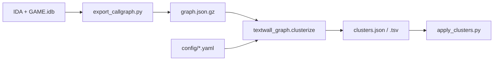

# Textwall call-graph clustering

Standalone tooling to segment the GAME.exe `.text` function wall by **call-graph structure** (SCC / WCC + optional merge). Not tied to `TheGame.dll` or game hooks.

## Pipeline

1. **Export** (IDA, GAME.idb open) → `out/graph.json.gz`
2. **Cluster** (Python) → `out/clusters.json` + `out/clusters.tsv`
3. **Optional** apply colors in IDA from `clusters.tsv`



## Setup

```powershell
cd tools\textwall-graph
pip install -e .
```

## 1. Export graph (IDA)

Open GAME in IDA, wait for auto-analysis, then:

- **File → Script file…** → `tools/textwall-graph/ida/export_callgraph.py`

Or IDA MCP `py_exec_file` with the absolute path to that script.

**Note:** Full export (~113k functions) takes several minutes; run via **File → Script file** (not MCP — 60s tool timeout). Watch stdout for `edge scan` progress lines.

### Environment variables

| Variable | Default | Meaning |
|----------|---------|---------|
| `TEXTWALL_OUT` | `tools/textwall-graph/out/graph.json.gz` | Output path |
| `TEXTWALL_SEGMENT` | `auto` | Segment selector (see below) |
| `TEXTWALL_LIST_SEGMENTS` | `0` | `1` = print all segments and exit |
| `TEXTWALL_INCLUDE_LIB_THUNKS` | `0` | `1` = skip no thunk/lib filtering (~120k nodes); `0` drops `FUNC_LIB` / `FUNC_THUNK` / `j_*` (~113k) |

**GAME.exe** has no `.text` section; executable code lives in **two unnamed CODE segments**. Default `auto` includes every IDA `CODE` class segment (both unnamed blobs). To inspect names/ranges first:

```powershell
# In IDA before export:
# set TEXTWALL_LIST_SEGMENTS=1 and run export_callgraph.py
```

`TEXTWALL_SEGMENT` values:

| Value | Behavior |
|-------|----------|
| `auto` (default) | All `CODE` segments, sorted by size |
| `.text` | Named `.text` if present, else same as `auto` |
| `seg_00401000,seg_00A00000` | Explicit list; use `seg_<start_ea>` for unnamed sections |

Stdout should end with `TEXTWALL_EXPORT_OK` and node/edge counts.

## 2. Cluster (offline)

From `tools/textwall-graph`:

```powershell
python -m textwall_graph.clusterize out/graph.json.gz -c config/default.yaml -o out/clusters.json --histogram
```

Or via just (from repo root):

```powershell
just -f tools/textwall-graph/justfile cluster
just -f tools/textwall-graph/justfile cluster-merge
just -f tools/textwall-graph/justfile cluster-wcc
just -f tools/textwall-graph/justfile sweep
```

### Config (`config/*.yaml`)

| Key | Effect |
|-----|--------|
| `algorithm: scc` | Directed strongly connected components (Tarjan) |
| `algorithm: wcc` | Undirected components on symmetrized edges |
| `min_component_size` | Omit smaller components from output (unless `report.bucket_small`) |
| `merge.enabled` | After SCC, merge tiny components into neighbors |
| `merge.max_scc_size` | Merge SCCs with at most this many functions |
| `merge.min_shared_edges` | Minimum condensation cross-edges to merge |

Edit YAML only to tune thresholds—no algorithm code changes needed.

Presets:

- `config/default.yaml` — raw SCC
- `config/merge_small.yaml` — merge SCCs ≤20 nodes with ≥2 cross-edges
- `config/wcc.yaml` — undirected connected components

## 3. Apply colors (IDA, optional)

```powershell
$env:TEXTWALL_TSV = "C:\...\tools\textwall-graph\out\clusters.tsv"
```

Run `ida/apply_clusters.py` in IDA. Functions get a cycling background color and `cluster:N` comment prefix.

## Export format

Compressed JSON with dense node indices and edge list `[caller_i, callee_i]` (code xrefs only; caller and callee must lie in selected CODE segment(s)). Meta includes `segments: [{name, start, end}, ...]`.

## Interpretation caveats

- Clusters reflect **call connectivity**, not linker library boundaries.
- Pure SCC yields mostly **size-1** components; use `wcc` or `merge_small` for larger blobs.
- IAT/thunk bridges can link unrelated regions—try `TEXTWALL_INCLUDE_LIB_THUNKS=0` (default).
- Corroborate interesting clusters with strings/xrefs (e.g. ProudNet RVAs in `docs/proudnet-ida-reimpl.md`).

## Sanity checks on GAME

1. `node_count` ≈ Functions in the selected CODE segment(s) (both unnamed blobs with `auto`).
2. Under `merge_small` or `wcc`, ProudNet samples (`0xD653B0`, `0xD6EF90`, `0xD84BB0`) may share a moderate component—**not guaranteed**.
3. Sweep `merge.max_scc_size` via copied YAML presets; compare `stats.largest` in output JSON.
